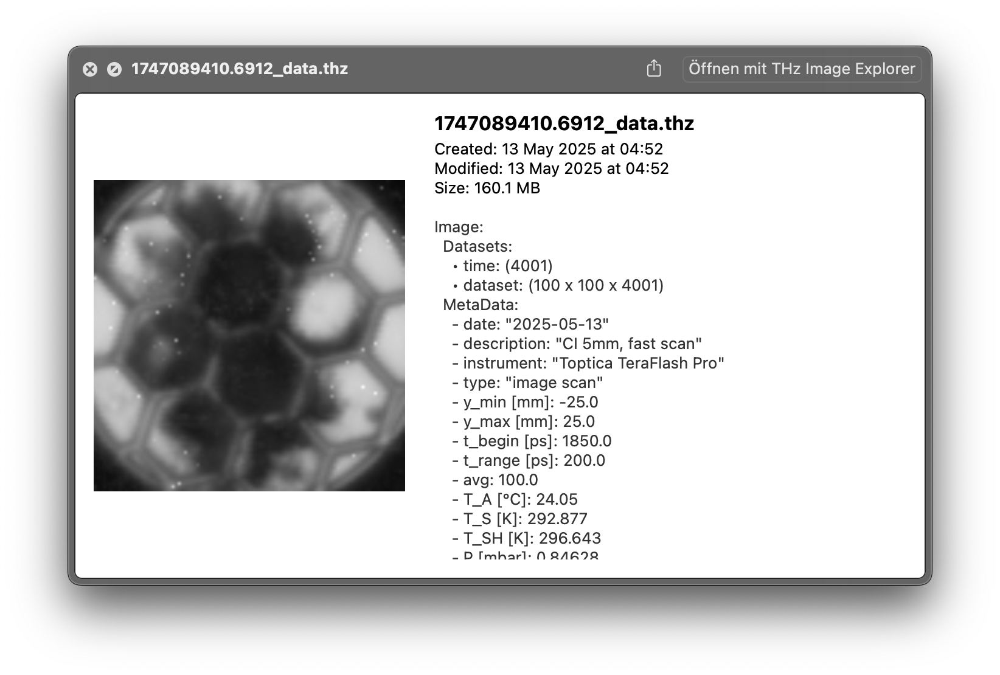

[](https://github.com/hacknus/DotTHzQL/actions/workflows/swift.yml)

# A dotTHz QuickLook Plugin for macOS Finder

<a href="https://github.com/hacknus/DotTHzQL/releases"> </img> </a>

This is a simple Quicklook plugin for macOS Finder to preview the structure of [dotTHz](https://github.com/dotTHzTAG) files, for imaging scans it also provides a simple render/preview. This works with extensions `.thz`, `.thzimg` and `.thzswp`.



It requires that `hdf5` is installed: 
```shell
brew install hdf5
```

## Installation

Pre-compiled binaries are provided for Apple Silicon (Arm64) here: [Releases](https://github.com/hacknus/DotTHzQL/releases)

To install, you need to place the main app `DotTHzQL.app` in the `Applications` folder and launch it once. This should register the plugin with the operating system and it should work.
The main app needs to remain in the `Applications` folder.

If it does not work, try running this:
```shell
qlmanage -r cache
qlmanage -r
killall -9 Finder
killall -9 mdworker_shared
```
